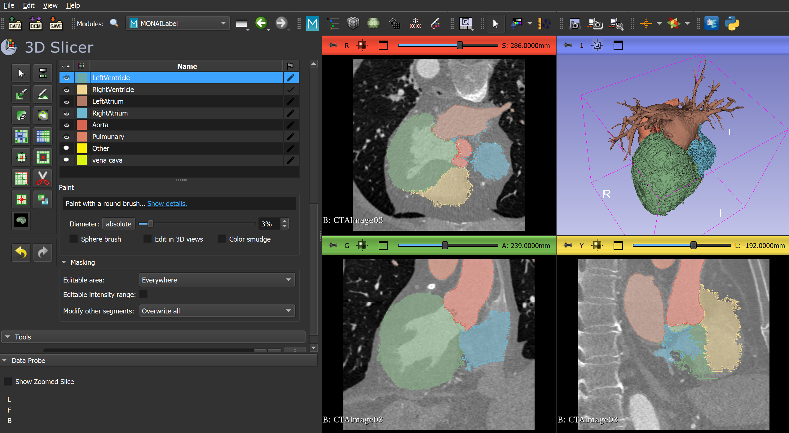

# Ventricle Segmentation

The left ventricle segmentation out of the coronary CT angiography (cCTA) images is needed for some research methods such as calculating myocardial blood flow (MBF). In this repo, I developed a pipeline to segment the left ventricle automatically using MONAI label and nnU_Net models on 3D slicer.

The project repository is as below:
    
    Ventricle_Segmentation
    |-Ventricle_Segmentation
      |-ImageTools
        |-ConvertVTK2NIFTI.py >>> takes a folder containing vtk/vti images and convert them into nifti.
        |-shuffle_images.py   >>> shuffles between images in a folder and takes a few number of them for manual segmentation
        |-VTI2VTK.py          >>> Takes a folder containing vti images and returns vtk images that are supported in Slicer.
    |-Images
    |-.gitignore
    |-LICENSE
    |-README.md >>> this file

The pipeline is available below:

## 1. Manual Segmentation and Image Processing

Use the tools in the ImageTools folder to convert the images into nifti for them to be supported on Slicer. Use the following commands on your terminal:
```bash
python ImageTools/ConvertVTK2NIFTI.py -InputFolder /path/to/the/folder/containing/vtk/images -Nformat nii or nii.gz
```

For manual segmentation shuffle the images and take some of them to apply manual segmentation on:

```bash
python ImageTools/shuffle_images.py -InputFolder /path/to/the/folder/containing/nifti/images -OutputFolder /path/to/the/output/folder
```

Use the manual segmentation tools on 3DSlicer to segment the left ventricle in the folder containing the selected shuffle images. for more information check out [this video](https://www.youtube.com/watch?v=BJoIexIvtGo&t=10s):



Note: refine the left ventricle segmentation slide by slide in each direction.

In order to save the segmentation in vtp format use the following steps:

1. on Data tab, export segmentations into a model.


2. Export the left ventricle segmentation to file:


3. save it in your desire format such as vtp or stl:

